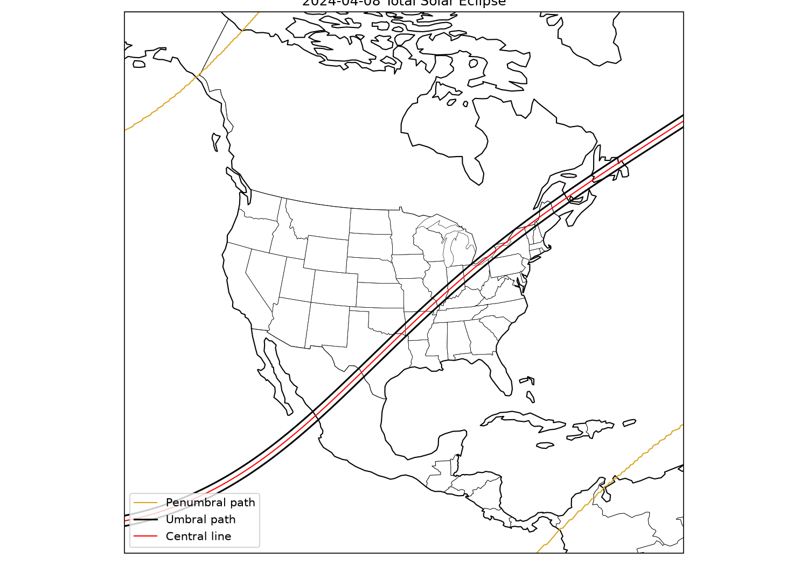

# besselian2shape

Generate ESRI Shapefiles and Google Earth KML/KMZ files describing a solar
eclipse's visibility from NASA's Besselian elements dataset: the central
line, the umbral/antumbral path of totality or annularity, and the
penumbral region from which at least a partial eclipse is visible.

Besselian elements are downloaded once from NASA's [Five Millennium Canon
of Solar Eclipses](https://eclipse.gsfc.nasa.gov/) and cached locally.


Example shapefile generated for the 2024-04-08 total solar eclipse

## Installation

```bash
pip install besselian2shape
```

Requires Python 3.11+.

## CLI usage

```bash
besselian2shape YEAR MONTH DAY [options]
```

`YEAR` uses astronomical numbering for BCE dates (1 BCE is year `0`, 2 BCE
is year `-1`, etc.).

```bash
# Shapefiles (default) for the 2024 total eclipse, written to ./eclipse_2024-04-08
besselian2shape 2024 4 8

# KMZ file in a custom directory
besselian2shape 2017 8 21 -o out/ -f kmz

# Every format at once
besselian2shape 2024 10 2 -f all
```

Options:

| Flag | Default | Description |
| --- | --- | --- |
| `-o, --output DIR` | `./eclipse_YYYY-MM-DD` | Output directory |
| `-f, --format {shp,kml,kmz,all}` | `shp` | Output format; may be repeated |
| `--step-minutes MINUTES` | `0.5` | Time resolution for sampling the central line and umbral path |
| `--penumbral-resolution DEGREES` | `0.25` | Grid resolution for the penumbral visibility boundary |
| `--penumbral-step-minutes MINUTES` | `1.5` | Time step for the penumbral visibility raster scan |
| `--refresh-cache` | | Re-download the Besselian elements dataset even if already cached |

Negative-year (BCE) example:

```bash
besselian2shape -1999 6 12 -f kml
```

Shapefile output writes up to three layers into the output directory:

- `penumbral_path.shp` -- polygon (all eclipse types)
- `central_line.shp` -- polyline (total/annular/hybrid only)
- `umbral_path.shp` -- polygon (total/annular/hybrid only)

KML/KMZ output writes a single file (`eclipse.kml` or `eclipse.kmz`)
containing the same layers as separate placemarks.

## Python API

```python
from besselian2shape import generate_eclipse_shapefiles, generate_eclipse_kml

# Shapefiles
written = generate_eclipse_shapefiles(2024, 4, 8, "output_dir")
# {"penumbral_path": Path(...), "central_line": Path(...), "umbral_path": Path(...)}

# KML/KMZ (format is inferred from the output path's suffix)
generate_eclipse_kml(2024, 4, 8, "output_dir/eclipse.kmz")
```

Both functions raise `LookupError` if no eclipse occurred on the given
date. Both accept the same optional keyword arguments:

- `csv_path`: use a specific Besselian elements CSV instead of the cached
  download.
- `step_minutes` (default `0.5`): sampling density along the central
  line/umbral path.
- `penumbral_resolution_deg` / `penumbral_step_minutes` (defaults `0.25`,
  `1.5`): grid resolution and time step for the penumbral coverage
  raster -- lower values are more accurate but slower.
- `elements`: an already-looked-up `BesselianElements` instance, to avoid
  parsing the CSV twice when generating more than one format for the same
  eclipse:

```python
from besselian2shape import find_by_date, generate_eclipse_shapefiles, generate_eclipse_kml

e = find_by_date(2024, 4, 8)
generate_eclipse_shapefiles(2024, 4, 8, "output_dir", elements=e)
generate_eclipse_kml(2024, 4, 8, "output_dir/eclipse.kmz", elements=e)
```

### Other public functions

- `find_by_date(year, month, day, csv_path=None) -> BesselianElements`
- `load_all(csv_path=None) -> list[BesselianElements]`
- `download_besselian_csv(force=False) -> Path`
- `get_cache_dir() -> Path`
- `get_cached_csv_path() -> Path`

`BesselianElements` is a frozen dataclass holding one eclipse's metadata
(date, Saros number, gamma, magnitude, path width, etc.) and its raw
Besselian polynomial coefficients (`x0..x3`, `y0..y3`, `d0..d2`,
`mu0..mu2`, `l10..l12`, `l20..l22`, `tan_f1`, `tan_f2`, `t0`, `tmin`,
`tmax`), as published in NASA's dataset.

## Development

```bash
uv sync
uv run pytest
```
